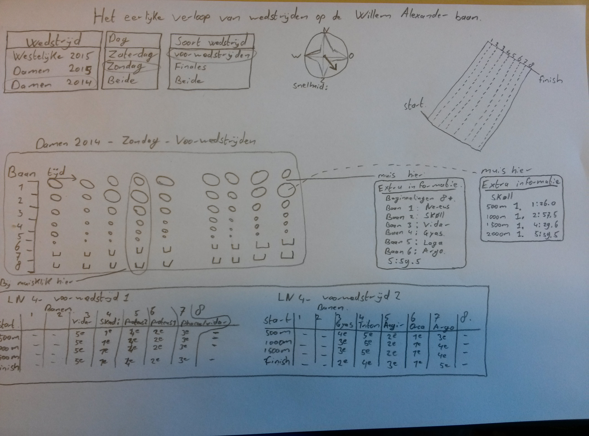

#Visualisatie meer op een technische wijze belicht.#

##Minimale en optionele functies visualisatie.##
De visualisatie zal in minimale vorm in staat moeten zijn op de volgende punten te werken:
  * de data in te laden.
  * statische weergave van de baankaart.
  * keuze menu voor de verschillende wedstrijden.
    - dus de juiste selectie van de data gebruiken.
  * keuze menu voor verschillende dagen van een wedstrijd.
    - dus de juiste selectie van de data gebruiken.
  * keuze menu voor alleen voorwedstijden, alleen finales of beide.
  * windroos aanpassen op windrichting gekozen dag.
  * scatter plot maken over de hele dag gezien, waarbij van elke heat snel kan worden gezien welke baan gewonnen heeft
  * bij het plaatsen van de muis over een heat moet er een weergave komen van
    1. de heat naam
    2. welke ploeg in welke baan ligt
    3. de winnende tijd

Optioneel toe te voegen is:
  * extra grafieken van alle heats in een veld als er wordt geklikt op een heat
  * bij het plaatsen van de muis over een data punt in de scatter plot moet er een weergave komen van:
    1. de ploeg
    2. de 500m tijd en positie
    3. de 1000m tijd en positie
    4. de 1500m tijd en positie
    5. de 2000m tijd en positie

##Uitgebreide schets##

##Componenten##
1. HTML pagina
  * pagina kan geopend worden waardoor de visualisatie zichtbaar is.
2. Javascript
  * wordt gebruikt om de data in te lezen als json bestanden.
  * wordt gebruikt om met d3 een visualisatie te maken van de data
  * aangezien er gebruik wordt gemaakt van meerdere JSON bestanden zal hier gebruik worden gemaakt van een queue.
3. Data
  * python wordt gebruikt om de resultaten van de roeiwedstrijden te scrapen. Aangezien de resultaten pagina's net anders zijn opgebouwd zijn 3 verschillende scrapers gebouwd die de data binnen halen en elk de data opslaan in een aparte JSON file. Er zijn dus 3 JSON files, elk voor een wedstrijd.
  * een JSON file van een wedstrijd is een lijst van lijsten, ofwel de resultaten. Elke lijst bevat de dag, de tijd, de naam van het veld, de naam van de betreffende ploeg en een dictionary van resultaten. de resultaten dictionary op zijn tijd is opgedeeld in verschillende dictionaries zodat van elk 500m interval er een tijd en positie in staat.
  * wind data voor de verschillende dagen (waarop de wedstrijden verroeid zijn) is gedownload van http://www.knmi.nl/klimatologie/uurgegevens/selectie.cgi, van weerstation Rotterdam. Waarbij de windrichting, de gemiddelde windsnelheid en maximale windstoten voor elk uur te vinden zijn. De gedownloade data staat in een csv bestand, maar kan worden omgezet in een json bestand.

