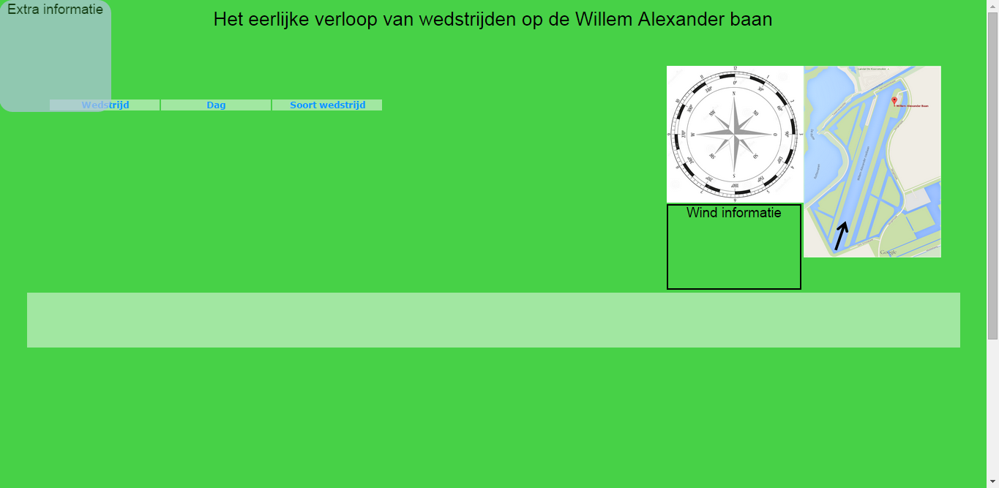

#Visualisatie meer op een technische wijze belicht.#

##Minimale en optionele functies visualisatie.##
De visualisatie zal in minimale vorm in staat moeten zijn op de volgende punten te werken:
  * de data in te laden.
  * statische weergave van de baankaart.
  * keuze menu voor de verschillende wedstrijden.
    - dus de juiste selectie van de data gebruiken.
  * keuze menu voor verschillende dagen van een wedstrijd.
    - dus de juiste selectie van de data gebruiken.
  * keuze menu voor alleen voorwedstijden, alleen finales of beide.
  * windroos aanpassen op windrichting gekozen dag.
  * scatter plot maken over de hele dag gezien, waarbij van elke heat snel kan worden gezien welke baan gewonnen heeft
  * bij het plaatsen van de muis over een heat moet er een weergave komen van
    1. de heat naam
    2. welke ploeg in welke baan ligt
    3. de winnende tijd

Optioneel toe te voegen is:
  * extra grafieken van alle heats in een veld als er wordt geklikt op een heat
  * bij het plaatsen van de muis over een data punt in de scatter plot moet er een weergave komen van:
    1. de ploeg
    2. de 500m tijd en positie
    3. de 1000m tijd en positie
    4. de 1500m tijd en positie
    5. de 2000m tijd en positie

##Uitgebreide schets##

##Componenten##
1. HTML pagina
  * pagina kan geopend worden waardoor de visualisatie zichtbaar is.
2. Javascript
  * Queue
    * Aangezien er meer json bestanden zijn, wordt queue gebruikt om eerst alle data in te lezen.
  * D3
    * wordt gebruikt om met d3 een visualisatie te maken van de data
3. Data
  * python wordt gebruikt om de resultaten van de roeiwedstrijden te scrapen. Aangezien de resultaten pagina's net anders zijn opgebouwd zijn 3 verschillende scrapers gebouwd die de data binnen halen en elk de data opslaan in een aparte JSON file. Er zijn dus 3 JSON files, elk voor een wedstrijd.
  * een JSON file van een wedstrijd is een lijst van lijsten, ofwel de resultaten. Elke lijst bevat de dag, de tijd, de naam van het veld, de naam van de betreffende ploeg en een dictionary van resultaten. de resultaten dictionary op zijn tijd is opgedeeld in verschillende dictionaries zodat van elk 500m interval er een tijd en positie in staat.
  * wind data voor de verschillende dagen (waarop de wedstrijden verroeid zijn) is gedownload van http://www.knmi.nl/klimatologie/uurgegevens/selectie.cgi, van weerstation Rotterdam. Waarbij de windrichting, de gemiddelde windsnelheid en maximale windstoten voor elk uur te vinden zijn. De gedownloade data staat in een csv bestand, maar kan worden omgezet in een json bestand.

##voorvertoning pagina layout##

Rechtsbovenaan is de statische kaart van de baan met de vaar-richting weergegeven door de zwarte pijl. Links daarvan zien we de windroos waar met behulp van een SVG'tje een pijl de windrichting weer zal geven van de dag die geselecteerd is. Onder de windroos is een div-element geplaatst waar extra informatie over de wind komt, namelijk de gemiddelde richting en snelheid van de dag en de maximale windstoot. De inhoud van dit div-element wordt dus vanuit het schript nog bijgewerkt.

Links zien we het keuze menu waar event-listeners op gezet worden. Als er een wedstrijd gekozen wordt, worden het juiste uitslagen bestand en weer bestand geselecteerd voor de visualisatie. De visualisatie zal standaard worden gemaakt voor de zaterdag, alle velden. Als een dag en soort wedstrijd geselecteerd worden, wordt het juiste deel van de data gepakt en de visulisatie aangepast.

De visualisatie zal worden getekend in het SVG-element wat hier in licht groen te zien is, de hoogte van het svg element zal iets groter uitvallen. Echter zullen de verschillende banen worden weergegeven op de y-as en de tijd op de x-as. De grootte of kleur van het data punt geeft aan wat de finish volgorde geweest is per heat.

Gaat de gebruiker met de muis op de visualisatie staan wordt gekeken welke heat dit is en wordt de tooltip, een div-element, op zichtbaar gesteld en de positie aangepast naar net naast de muis (in bovenstaande afbeelding links boven en nog zichtbaar). In de tooltip wordt de informatie steeds bijgewerkt, afhankelijk van waar de muis is. Komt de muis op een data punt, wordt de inhoud van de tooltip bijgewerkt voor specifiek die ploeg. Om te voorkomen dat de tooltip in beeld blijft als hij eenmaal op zichtbaar is gesteld zal er ook een functie de zichtbaarheid weer weghalen als de muis uit het gebied beweegt.
Bij het klikken op een heat wordt een nieuwe SVG zichtbaar waar een overzicht van het veld wordt weergegeven waar deze heat bij hoort. Van elke heat van dit veld wordt dan een klein grafiekje getoond met de voortgang van alle ploegen per 500m. Wordt er op het gebied geklikt waar deze grafiekjes staan, wordt de zichtbaarheid van het gebied weggehaald.