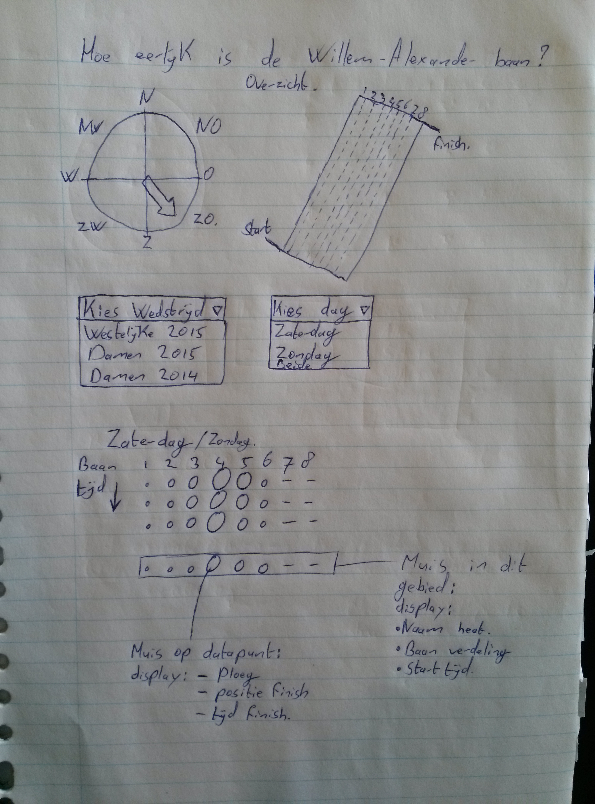
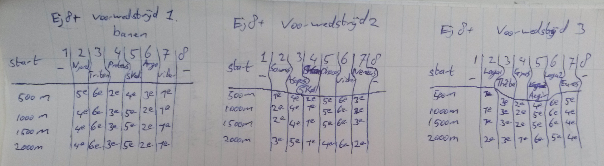

# De eerlijkheid van de Willem-Alexander roeibaan nabij Rotterdam
Dit is mijn inzending voor het vak Programmeerproject 2015.  
Floris Stevens. 	
10182195

##idee##

####Hoe eerlijk is de Willem-Alexander baan?####
In de roeiwereld wordt veel gepraat over zogeheten "voordeellanen", waar je voordeel zou kunnen ondervinden van de wind en/of stroming, waar je in een andere laan op de roeibaan dit voordeel niet hebt en zelfs een nadeel zou kunnen hebben.  Recent is er een nieuwe roeibaan in Nederland aangelegt, de Willem-Alexander baan. Deze baan is niet alleen qua faciliteiten een verbetering op de in Amsterdam gelegen Bosbaan, hij zou ook een stuk eerlijker zijn dan laatstgenoemde. Van de Bosbaan wordt gezegd dat het weer zeer veel invloed heeft op de stroming van het water in de  verschillende lanen, bij de nieuwe Willem-Alexanderbaan zou dit niet zo'n effect hebben.

De site van de Willem-Alexander baan zegt zelf:
"De roeibaan als geheel ligt open onder de hemel, alleen omringd door kleine rietlanden. De wind heeft er weliswaar vrij spel, maar treft alle banen even hard. Het maakt de Willem Alexander Baan tot een eerlijke wedstrijdbaan."

Ik ben benieuwd in hoeverre dit correct is. Is de Willem-Alexander baan echt zo eerlijk als dat ze zelf beweren of is de baan in feite, net als
de Bosbaan, beinvloedbaar door de wind.

##Verschillende onderdelen##

1. HTML pagina
  * Met aparte CSS file
  * Baan kaart bovenaan (statisch)
2. Windroos
  * Windrichting van de dag, afhankelijk van de gekozen dag bij punt 3.
  * Wind snelheid, afhankelijk van gekozen dag bij punt 3. 
3. Keuze menu voor verschillende velden
  * Kies wedstrijd (Westelijke 2015/Damen 2015/ Damen 2014)
  * Kies dag (Zaterdag/Zondag)
  * Kies veld (een specifiek roei-veld of alle velden)
4. Grafieken die weergeeft in welke laan de winnende ploeg lag, per heat.

Omdat alleen bij de voorwedstrijden de laan indeling volledig random geloot wordt, zal ik beginnen met alleen de voorwedstrijden van alle velden. Ploegen die winnen in de voorwedstrijd mogen in de finale in de gunstigste baan starten en dus zou dit een vertekend beeld kunnen geven. Wel Zou ik dit graag ook nog opnemen in een grafiek. Misschien dat het keuze menu uitgebreidt moet worden met een optie voor het soort wedstrijd (Voorwedstrijden, finales of beiden) waarna de gevraagde specificatie getekend wordt.  
Als de muis over een punt in de scater plot gaat zal een tooltip verschijnen waarin de ploegnaam, behaalde plaats en gevaren tijd worden weergegeven. Als de muis over het gebied gaat waar een heat in weergegeven wordt zal een tooltip moeten opkomen wie weergeeft welke heat dit is, welke ploegen er starten en in welke laan deze liggen. Zodra er op geklikt wordt zal een nieuwe visualisatie getekend moeten worden waarin van dat veld een voortgangs grafiek wordt getekend, Zoals hier onder schematisch weergegeven.

##platform and external components##
Een HTML pagina zal worden gemaakt waar d3 en Javascript zullen worden gebruikt om een visualisatie zichtbaar te maken.

##Benodigde data##
Om de vraag te kunnen beantwoorden hoe eerlijk de Willem-Alexander baan nou is moet er natuurlijk weersdata zijn en roeiuitslagen nodig

De weersdata zal worden gedownload van http://www.knmi.nl/climatology/daily_data/selection.cgi voor weersstation Rotterdam waar de Richting van
de wind en de snelheid de belangrijkste variabelen zijn.  
  1.	23 & 24 mei 2015 (Westelijke)
  2.	 2 &  3 mei 2015 (Damen 2015)
  3.	 3 &  4 mei 2014 (Damen 2014).

De roeiuitslagen zullen worden gescraped van time-team.nl.  
  1.	Westelijke 2015
  2.	Damen 2015
  3.	Damen 2014.

Uiteindelijke visualisatie zal met behulp van D3 gemaakt worden en dus zal de data waarschijnlijk omgezet worden in JSON formaat.
De uitslagen bevatten veel informatie en in elkgeval de starttijd, de loting over de lanen, de tussentijden, de tussenstanden en de finish volgorde en tijd zullen worden opgeslagen.

##Mogelijke problemen##
Het Crawlen van alle resultaten is al een redelijke klus, het lijkt me daarom voldoende om enkel de gekozen drie wedstrijden te doen. Mocht het echter passen wil ik kijken of ik het nog kan uitbreiden naar meer wedstrijden.

Moeilijkheid in het keuze menu waar een wedstrijd, een dag en het soort wedstrijd gekozen kan worden. De juiste data moet hier dan bijgepakt worden. Ik heb nog geen ervaring met zo'n splitsing in data.

De interactieve aspecten zijn de tooltip met wisselende inhoud die moet verschijnen/verdwijnen. en het geannimeerd uitklappen van de voortgangs grafieken van een heel veld als er in de grafiek op een heat geklikt wordt. Mocht er ruimte zijn wil ik hier meer interactie inbouwen.